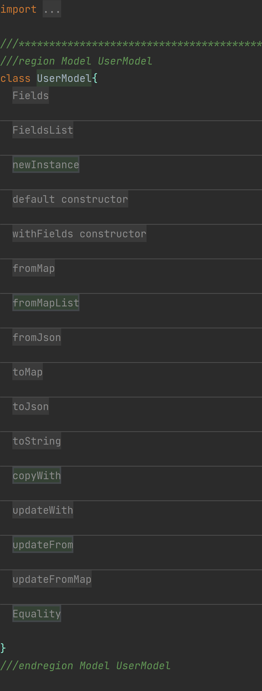

# Flutter_Super_Model_Builder :100: :100:

Flutter super model builder is an easy tool for creating flutter models with all necessary functions and utilities to make development process easier and maintainable.

# New Changes:
* Json model generators


##### Web version: :hotel:

> <a href="https://a7mdragab1.github.io/FlutterSuperModelBuilder" target="_blank">Flutter Super Model Builder Web version</a>


##### Windows version: :desktop_computer:

> <a href="https://github.com/a7mdragab1/FlutterSuperModelBuilder/releases/download/v1.1.7.0/super_model_builder_1.1.7.0.msix" target="_blank">Flutter_super_model_builder_v1.1.7.0.msix</a>


# Features:
* Class Fields
* Fields Declaration
* Model Fields
* NewInstance
* DefaultConstructor
* NamedConstructor
* FromMap
* FromMapList
* FromJson
* ToMap
* ToJson
* ToString
* CopyWith
* UpdateWith
* UpdateFrom
* UpdateFromMap
* Equality


<<<<<<< HEAD
=======
##### Web version: :hotel:

> <a href="https://a7mdragab.github.io/flutter_super_model_builder" target="_blank">Flutter Super Model Builder Web version</a>


##### Windows version: :desktop_computer:

> <a href="https://github.com/a7mdragab1/FlutterSuperModelBuilder/releases/download/v1.1.7.0/super_model_builder_1.1.7.0.msix" target="_blank">Flutter_super_model_builder_v1.1.7.0.msix</a>


## Getting started


Add to your project yaml dependencies:
```dart
dependencies:
  intl: ^0.19.0
```
Add to your project yaml dependencies if you need date only fields:

https://pub.dev/packages/date_only_field
```dart
dependencies:
  date_only_field: ^0.0.14
```

## Usage

## The Normal Fields MODEL Layout


## The Json Fields MODEL Layout


## The OUTPUT MODEL Layout


## The OUTPUT MODEL Code


## Download

##### Web version: :hotel:

> <a href="https://a7mdragab1.github.io/FlutterSuperModelBuilder" target="_blank">Flutter Super Model Builder Web version</a>


##### Windows version: :desktop_computer:

> <a href="https://github.com/a7mdragab1/FlutterSuperModelBuilder/releases/download/v1.1.7.0/super_model_builder_1.1.7.0.msix" target="_blank">Flutter_super_model_builder_v1.1.7.0.msix</a>

`Any features needed will be added. Just tell me.`
